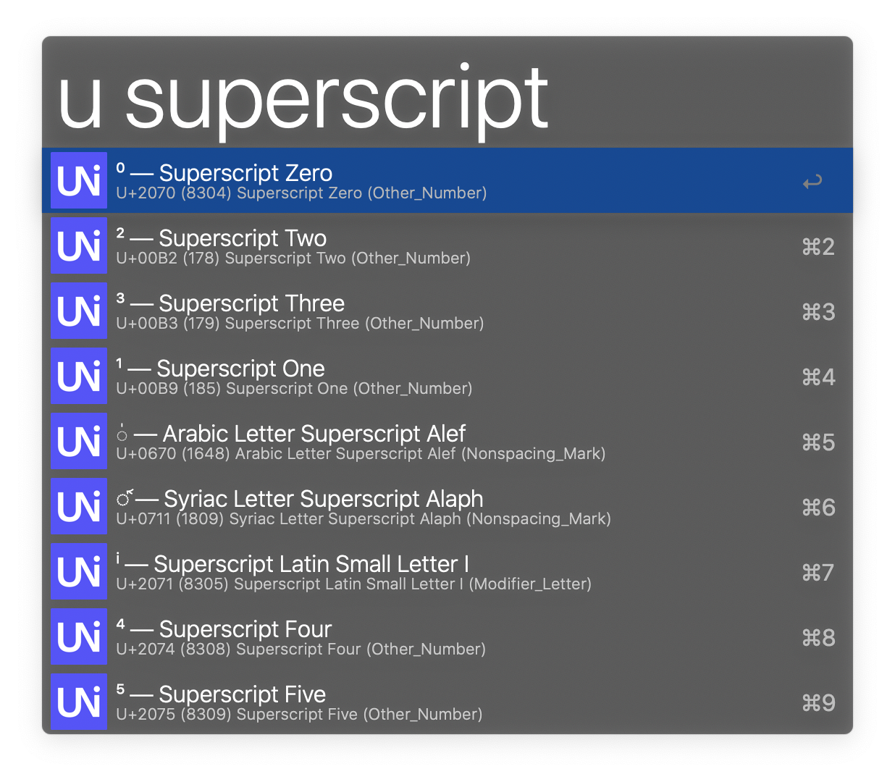
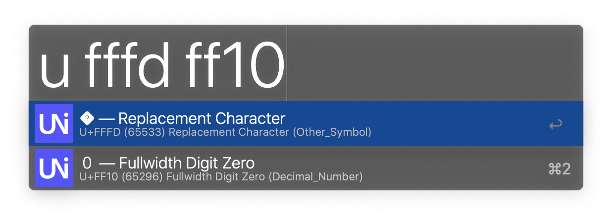
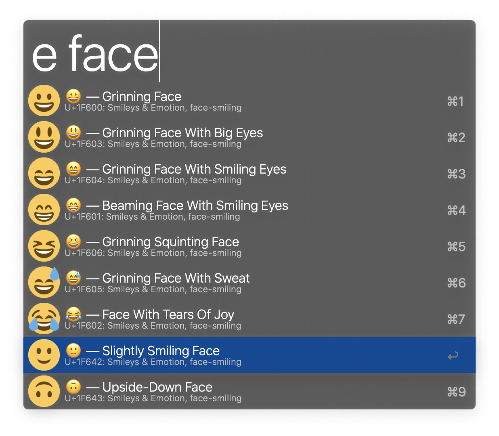
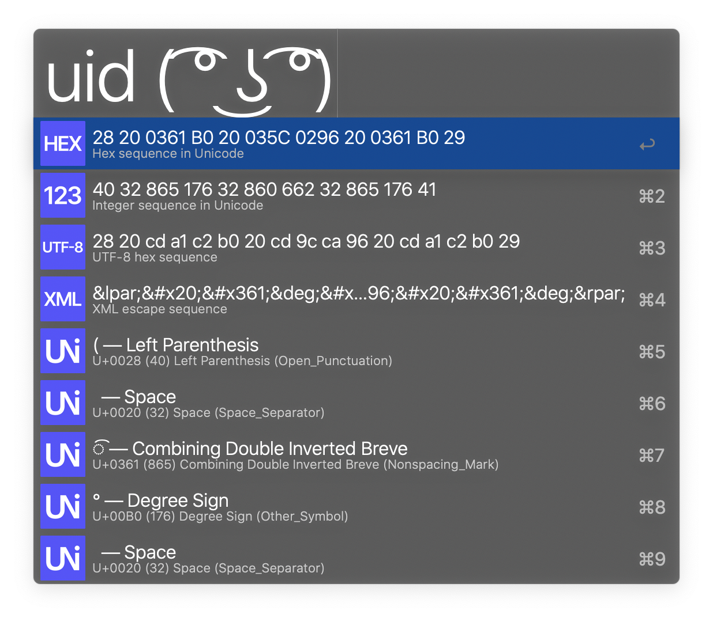

# Search Unicode

Search Unicode is an Alfred 4 Workflow to lookup and reverse lookup Unicode characters and emoji with their names.

## Download

Download it at the [release page](https://github.com/blueset/alfred-search-unicode/releases).

You need to install Python 3 on your macOS in order for this to work.
You can install that with [Homebrew] using the command below:

```sh
brew install python
```

[Homebrew]: https://brew.sh/

<details>
  <summary>Seeing “‘uni’ cannot be opened because the developer cannot be verified”?</summary>
  
  It can be resolved by:

  <ol>
    <li>Open <em>Alfred Preferences > Workflows</em> section </li>
    <li>Right-click “Search Unicode” > “Open in Finder”</li>
    <li>Right-click the <code>uni</code> executable and choose “Open” and allow it to run, then quit Terminal or close the window</li>
  </ol>
  
  Thanks <a href="https://github.com/blueset/alfred-search-unicode/issues/3">valrus (Ian McCowan)</a> for the instructions.
</details>

## Usage

### Search character by description



Type `u keyword` (ex. `u superscript`) to get a list of characters
matching the keyword.

- Press <kbd>Return</kbd> to copy the character to clipboard (ex. `⁰`)
- Press <kbd>Cmd</kbd> + <kbd>Return</kbd> to copy its Hex code to clipboard (ex. `U+2070`)
- Press <kbd>Option</kbd> + <kbd>Return</kbd> to copy its name to clipboard (ex. `Superscript Zero`)

### Search character by code point



Type `u codepoint [[codepoint] ...]` (ex. `u fffd ff10`) to look up characters by its codepoint.

The same 3 options apply here too.

### Search emoji by name



Type `e keywords` (ex. `e face`) to look up characters by its codepoint. Press <kbd>Return</kbd> to copy the character to clipboard (ex. `😀`)

### Identify characters in a string



Type `uid string` (ex. `uid ( ͡° ͜ʖ ͡°)`) to identify characters in a string.

For the first 4 rows (hex sequence, integer sequence, UTF-8 sequence and XML escape sequence):

- Press <kbd>Return</kbd> to copy the sequence to clipboard (ex. `28 20 0361 B0 20 035C 0296 20 0361 B0 29`)

For the following rows that identifies each individual characters:

- Press <kbd>Cmd</kbd> + <kbd>Return</kbd> to copy its Hex code to clipboard (ex. `U+2070`)
- Press <kbd>Option</kbd> + <kbd>Return</kbd> to copy its name to clipboard (ex. `Superscript Zero`)

## Credit

This workflow depends on resources from:

- [arp242/uni] 1.0.0 with Unicode 12.1 Data
- [Twemoji] 12.1.4 for emoji preview

[arp242/uni]: https://github.com/arp242/uni
[Twemoji]: https://twemoji.twitter.com/

## License

```plain
Copyright 2019 Eana Hufwe <https://1a23.com>

Permission is hereby granted, free of charge, to any person
obtaining a copy of this software and associated documentation
files (the “Software”), to deal in the Software without
restriction, including without limitation the rights to use,
copy, modify, merge, publish, distribute, sublicense, and/or sell
copies of the Software, and to permit persons to whom the
Software is furnished to do so, subject to the following
conditions:

The above copyright notice and this permission notice shall be
included in all copies or substantial portions of the Software.

THE SOFTWARE IS PROVIDED “AS IS”, WITHOUT WARRANTY OF ANY KIND,
EXPRESS OR IMPLIED, INCLUDING BUT NOT LIMITED TO THE WARRANTIES
OF MERCHANTABILITY, FITNESS FOR A PARTICULAR PURPOSE AND
NONINFRINGEMENT. IN NO EVENT SHALL THE AUTHORS OR COPYRIGHT
HOLDERS BE LIABLE FOR ANY CLAIM, DAMAGES OR OTHER LIABILITY,
WHETHER IN AN ACTION OF CONTRACT, TORT OR OTHERWISE, ARISING
FROM, OUT OF OR IN CONNECTION WITH THE SOFTWARE OR THE USE OR
OTHER DEALINGS IN THE SOFTWARE.
```
